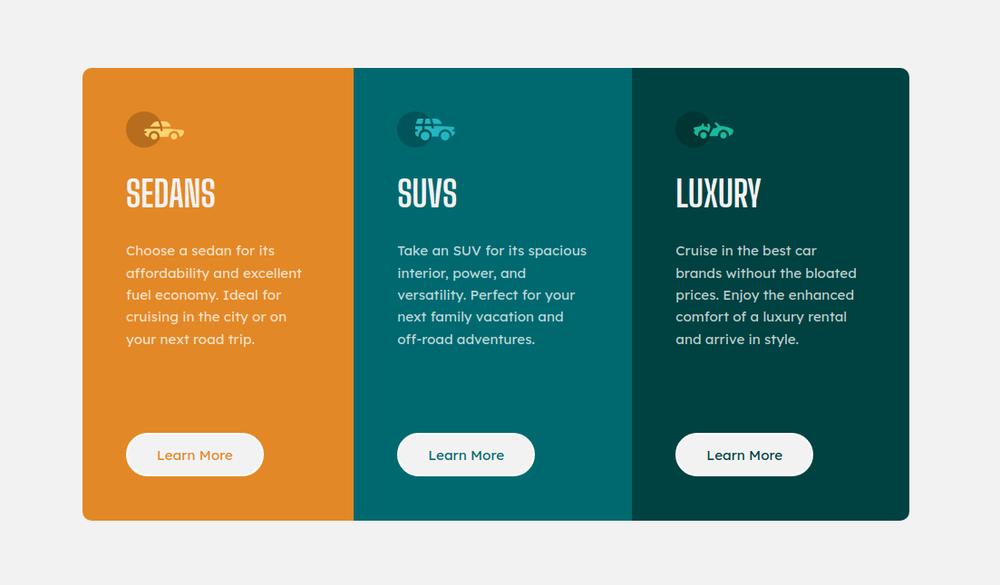

# Frontend Mentor - 3 column preview card component solution

## Table of contents

- [Overview](#overview)
  - [Screenshot](#screenshot)
  - [Links](#links)
- [My process](#my-process)
  - [Built with](#built-with)
  - [What I learned](#what-i-learned)
  - [Continued development](#continued-development)
- [Author](#author)

---

## Overview

### Screenshot

### Links

- Solution URL: https://github.com/alexandre-joliet/FEM-3_column_preview_card_component
- Live Site URL: https://alexandre-joliet.github.io/FEM-3_column_preview_card_component/

---

## My process

Quite simple project with no issues encountered.

1. Analyse of the design schema to identify the different items and how to built the right elements in the HTML file
2. First version of sections and classes by using the BEM methodology
3. Starting of building the style in CSS, from top to bottom
4. Polishing the desktop version
5. Building of the mobile version

### Built with

- Semantic HTML5 markup
- BEM methodology
- CSS custom properties
- Flexbox
- Desktop-first workflow

### What I learned

I put into practice what I've learned recently about BEM. Quite interesting and logical way to write HTML code. I find it more organized and easier to understand!

---

## Author

- Frontend Mentor - [@JojoRider](https://www.frontendmentor.io/profile/JojoRider)
